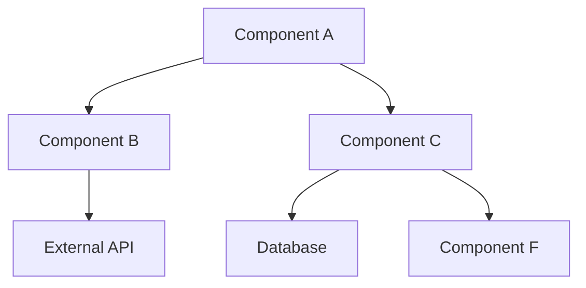

---
description: "Code-specific guidance for the planning phase of the release lifecycle"
globs: "**/code/planning/*.md,**/code/planning/*.mdx,**/releases/*/code_plan.md,**/releases/*/code_plan.mdx"
priority: 2
alwaysApply: false
type: "Auto-Attached"
---

# Code System Planning Guidance

<critical>
This rule provides specialized guidance for the planning phase when the primary system context is code-based system development. Apply these guidelines in conjunction with the core planning phase rules.
</critical>

## Code System Planning Approach

When planning code-based system changes, focus on these specialized aspects:

### 1. Technical Task Decomposition

Break down high-level requirements into implementable technical tasks:

```markdown
## Technical Task Breakdown

### Component-Based Decomposition
- **Component**: [Component Name]
  - **Task 1.1**: [Specific technical task]
    - **Description**: [Detailed description of what needs to be implemented]
    - **Technical Approach**: [Brief description of implementation approach]
    - **Acceptance Criteria**: [Specific, testable criteria for completion]
    - **Dependencies**: [Internal and external dependencies]
    - **Effort Estimate**: [Estimate in story points or hours]
    - **Technical Complexity**: [High/Medium/Low]
    - **Risk Level**: [High/Medium/Low]
  
  - **Task 1.2**: [Specific technical task]
    - [Additional task details...]

- **Component**: [Next Component Name]
  - **Task 2.1**: [Specific technical task]
    - [Task details...]

### Interface Requirements
- **API Changes**: [Specific API modifications or additions]
- **Data Model Changes**: [Changes to data structures or schemas]
- **UI Component Changes**: [Changes to user interface elements]
- **Integration Point Updates**: [Changes to external system integrations]
```

### 2. Architectural Planning

Plan architectural changes and considerations:

```markdown
## Architectural Planning

### Architecture Impact
- **Architecture Changes**:
  - [Specific changes to system architecture]
  - [Architectural pattern modifications]
  - [Component relationship changes]

- **Technology Decisions**:
  - **Libraries/Frameworks**: [New or updated libraries/frameworks]
  - **Languages/Tools**: [New or updated languages/tools]
  - **Infrastructure**: [Infrastructure changes required]
  
- **Design Patterns**:
  - [Key design patterns to be applied]
  - [Pattern adaptation considerations]
  - [Anti-patterns to avoid]

### Implementation Constraints
- **Performance Requirements**: [Specific performance constraints]
- **Security Requirements**: [Security considerations and requirements]
- **Compatibility Requirements**: [Backward compatibility needs]
- **Scalability Considerations**: [Scaling needs and approach]

### Architecture Decision Records
- **Decision 1**: [Key architectural decision]
  - **Context**: [Situation requiring decision]
  - **Options Considered**: [Alternative approaches evaluated]
  - **Decision**: [Selected approach]
  - **Rationale**: [Reasoning behind the decision]
  - **Consequences**: [Implications of this decision]
```

### 3. Technical Dependency Mapping

Identify and manage technical dependencies:

```markdown
## Technical Dependency Mapping

### External Dependencies
- **Third-Party Libraries**:
  - **Library Name**: [Version, purpose, constraints]
  - **Library Name**: [Version, purpose, constraints]

- **External Services**:
  - **Service Name**: [Integration point, dependencies, constraints]
  - **Service Name**: [Integration point, dependencies, constraints]

- **Platform Dependencies**:
  - **Platform Name**: [Version, requirements, constraints]
  - **Platform Name**: [Version, requirements, constraints]

### Internal Dependencies
- **Component Dependencies**:
  - **Component A → Component B**: [Dependency description, integration points]
  - **Component C → Component A**: [Dependency description, integration points]

- **Shared Resources**:
  - **Resource Name**: [Components utilizing this resource, constraints]
  - **Resource Name**: [Components utilizing this resource, constraints]

### Dependency Graph


### Critical Path Analysis
- **Critical Path**: [Sequence of high-dependency tasks]
- **Bottlenecks**: [Potential development bottlenecks]
- **Risk Mitigations**: [Approaches to address dependency risks]
```

### 4. Development Environment Requirements

Specify development environment needs:

```markdown
## Development Environment Requirements

### Environment Setup
- **Local Development**:
  - Required software and tools
  - Configuration settings
  - Local setup scripts or documentation
  - Environment variables

- **Continuous Integration**:
  - CI pipeline requirements
  - Build configurations
  - Test environment needs
  - Automated validation requirements

- **Testing Environments**:
  - Test data requirements
  - Mock service configurations
  - Environment isolation needs
  - Test infrastructure requirements

### Development Tools
- **Required Developer Tools**:
  - IDE configurations
  - Linters and formatters
  - Testing frameworks
  - Debugging tools

- **Specialized Tools**:
  - Performance testing tools
  - Security scanning tools
  - Documentation generators
  - Code quality analyzers
```

### 5. Testing Strategy

Plan comprehensive testing approach:

```markdown
## Testing Strategy

### Test Levels
- **Unit Testing**:
  - Framework: [Test framework]
  - Coverage targets: [Code coverage goals]
  - Focus areas: [Specific areas requiring thorough unit testing]
  - Mocking approach: [How dependencies will be mocked]

- **Integration Testing**:
  - Scope: [Components to be integration tested]
  - Integration points: [Specific interfaces to test]
  - Environment requirements: [Needs for integration testing]
  - Data requirements: [Test data needed]

- **End-to-End Testing**:
  - Key scenarios: [Critical paths to test end-to-end]
  - Automation approach: [How E2E tests will be automated]
  - Environment needs: [E2E testing environment requirements]
  - Tools: [E2E testing tools to be used]

### Specialized Testing
- **Performance Testing**:
  - Test scenarios: [Specific performance test cases]
  - Metrics: [Performance metrics to capture]
  - Tooling: [Performance testing tools]
  - Thresholds: [Acceptable performance thresholds]

- **Security Testing**:
  - Approach: [Security testing methodology]
  - Tools: [Security testing tools]
  - Focus areas: [High-risk areas for security testing]
  - Compliance requirements: [Security standards to meet]

### Test Data Management
- **Test Data Sources**: [Where test data will come from]
- **Data Generation**: [How test data will be generated]
- **Sensitive Data Handling**: [Approach to sensitive test data]
- **Environment Reset**: [How test environments will be reset]
```

### 6. Technical Risk Assessment

Identify and plan for technical risks:

```markdown
## Technical Risk Assessment

### Risk Identification
| Risk | Description | Impact | Likelihood | Risk Level |
|------|-------------|--------|------------|------------|
| [Risk 1] | [Detailed description] | High/Medium/Low | High/Medium/Low | High/Medium/Low |
| [Risk 2] | [Detailed description] | High/Medium/Low | High/Medium/Low | High/Medium/Low |

### Risk Mitigation Strategies
- **Risk 1**:
  - **Mitigation Approach**: [Specific mitigation strategy]
  - **Contingency Plan**: [What to do if risk materializes]
  - **Monitoring Approach**: [How to monitor for this risk]
  - **Owner**: [Risk owner]

- **Risk 2**:
  - [Risk mitigation details...]

### Technical Debt Considerations
- **Planned Technical Debt**:
  - **Area**: [Description of technical debt being accepted]
  - **Rationale**: [Why this debt is being accepted]
  - **Mitigation Plan**: [How and when this debt will be addressed]

- **Existing Technical Debt Impact**:
  - **Area**: [Existing debt affected by this release]
  - **Impact**: [How this release impacts existing debt]
  - **Approach**: [How existing debt will be managed]
```

### 7. Implementation Sequencing

Plan the implementation sequence:

```markdown
## Implementation Sequencing

### Implementation Phases
- **Phase 1: Foundation**
  - **Tasks**: [List of tasks in this phase]
  - **Goals**: [Specific goals for this phase]
  - **Deliverables**: [Expected outputs from this phase]
  - **Duration**: [Estimated timeframe]

- **Phase 2: Core Functionality**
  - [Phase details...]

- **Phase 3: Integration**
  - [Phase details...]

- **Phase 4: Refinement**
  - [Phase details...]

### Implementation Strategy
- **Incremental Approach**: [How features will be built incrementally]
- **Integration Points**: [When and how components will be integrated]
- **Validation Strategy**: [How validation will occur throughout implementation]
- **Feedback Loops**: [How feedback will be incorporated]
```

## Meta-Systemic Principle Application

### Parsimony in Code System Planning

1. **Reuse existing components**:
   - Identify opportunities to leverage existing code
   - Reference shared libraries and frameworks
   - Plan for consistent utility functions
   - Identify duplicate functionality for consolidation

2. **Plan efficient information structures**:
   - Design normalized data models
   - Plan shared type definitions
   - Identify canonical data sources
   - Design efficient state management

3. **Organize related functionality**:
   - Group related tasks for implementation efficiency
   - Design cohesive modules with clear responsibilities
   - Plan for shared implementation patterns
   - Identify common algorithms that can be abstracted

Example:
```markdown
## Component Reuse Strategy

Through analysis of existing codebases, we've identified several opportunities for reuse:

1. **Authentication Library**: The existing authentication library can be extended to support the new OAuth2 requirements rather than creating a new implementation.

2. **Data Processing Pipeline**: The ETL pipeline components from the analytics system can be adapted for the new data import functionality.

3. **UI Component Library**: Existing UI components will be leveraged and extended with new variants rather than creating custom components.

4. **Validation Framework**: The form validation framework will be reused with extended rule sets for the new forms.

This reuse strategy reduces implementation effort by approximately 30% while ensuring consistency with existing patterns.
```

### Tensegrity in Code System Planning

1. **Design balanced component relationships**:
   - Plan bidirectional interfaces between components
   - Design mutual support mechanisms
   - Balance responsibilities across components
   - Create resilient connection points

2. **Distribute technical responsibilities**:
   - Allocate tasks to balance team workload
   - Design components with complementary capabilities
   - Plan for mutual support within the team
   - Create backup responsibilities for critical areas

3. **Create resilient integration points**:
   - Design fault-tolerant interfaces
   - Plan for graceful degradation
   - Include retry and circuit breaker mechanisms
   - Design flexible but robust contracts

Example:
```markdown
## Component Relationship Design

The revised search subsystem will have these bidirectional relationships:

- **Search UI ↔ Search API**: 
  - UI provides user queries and display preferences
  - API provides results, suggestions, and available filters
  - Resilient connection with offline capability and retry logic

- **Search API ↔ Index Service**:
  - API provides query parameters and sorting requirements
  - Index Service provides result sets and facet information
  - Fault tolerance with circuit breaker and fallback mechanisms

- **Index Service ↔ Content Service**:
  - Index Service provides document references for detail retrieval
  - Content Service provides document content and metadata for indexing
  - Asynchronous updates with retry capabilities

This balanced design ensures components provide mutual value while maintaining resilience when individual components experience issues.
```

### Modularity in Code System Planning

1. **Define clear component boundaries**:
   - Plan explicit interfaces between components
   - Define clear API contracts
   - Establish data ownership boundaries
   - Create separation of concerns

2. **Design for independent evolution**:
   - Plan versioning strategies for interfaces
   - Design for backward compatibility
   - Create abstraction layers for external dependencies
   - Enable independent testing of components

3. **Establish interface contracts**:
   - Define input and output specifications
   - Document preconditions and postconditions
   - Specify error handling protocols
   - Create contract validation mechanisms

Example:
```markdown
## Modular Design Approach

The user management system will follow this modular approach:

1. **Interface Contracts**:
   ```typescript
   // User Service Interface
   interface UserService {
     getUser(id: string): Promise<User>;
     createUser(userData: UserCreateDTO): Promise<User>;
     updateUser(id: string, userData: UserUpdateDTO): Promise<User>;
     deleteUser(id: string): Promise<void>;
     findUsers(criteria: UserSearchCriteria): Promise<UserSearchResult>;
   }
   ```

2. **Component Boundaries**:
   - **User API**: External interface for user management
   - **User Service**: Business logic for user operations
   - **User Repository**: Data access for user records
   - **Authentication Service**: User authentication and authorization
   - **Notification Service**: Communication with users

3. **Independence Strategy**:
   - Each component will have independent test suites
   - Interfaces will support versioning with `Accept` header
   - Mock implementations will be created for all dependencies
   - Each component can be deployed independently
```

### Coherence in Code System Planning

1. **Apply consistent patterns**:
   - Plan consistent architectural approaches
   - Establish naming conventions
   - Define standard coding patterns
   - Create documentation templates

2. **Align with system patterns**:
   - Ensure compatibility with existing code patterns
   - Plan for consistent error handling
   - Design consistent logging and monitoring
   - Maintain consistent security approaches

3. **Create pattern guidance**:
   - Document standard patterns to follow
   - Provide examples of pattern application
   - Identify anti-patterns to avoid
   - Create pattern selection guidance

Example:
```markdown
## Pattern Consistency Strategy

To ensure coherence across the implementation, we will follow these pattern guidelines:

1. **Architectural Patterns**:
   - Repository pattern for data access
   - Command Query Responsibility Segregation (CQRS) for complex operations
   - Observer pattern for event notification
   - Strategy pattern for variable algorithms

2. **Code Structure Patterns**:
   - Feature-based directory organization
   - Interface-first design approach
   - Dependency injection for service composition
   - Factory methods for complex object creation

3. **Error Handling Patterns**:
   - Domain-specific error hierarchies
   - Consistent error return structures
   - Centralized error translation at boundaries
   - Structured logging with correlation IDs

4. **Naming Conventions**:
   - PascalCase for classes and interfaces
   - camelCase for methods and variables
   - UPPER_SNAKE_CASE for constants
   - kebab-case for file names
```

### Clarity in Code System Planning

1. **Create explicit technical specifications**:
   - Document detailed task requirements
   - Provide implementation examples
   - Create visual diagrams for complex logic
   - Include clear acceptance criteria

2. **Define terminology precisely**:
   - Create a glossary of domain terms
   - Use consistent terminology in documentation
   - Define technical terms clearly
   - Document acronyms and abbreviations

3. **Explain design decisions**:
   - Document the rationale for architectural choices
   - Explain pattern selection reasoning
   - Clarify trade-off decisions
   - Document constraints and requirements

Example:
```markdown
## Authentication Implementation Specification

### JWT Token Implementation

The authentication system will use JWT tokens with the following configuration:

```typescript
interface JWTConfig {
  algorithm: 'RS256';           // Using RSA with SHA-256
  expiresIn: '15m';             // Short-lived access tokens
  issuer: 'api.example.com';    // Identifies our service
  audience: 'example-client';   // Intended recipient
}
```

### Token Payload Structure

```typescript
interface TokenPayload {
  sub: string;      // Subject (user ID)
  roles: string[];  // User roles for authorization
  permissions: {    // Granular permissions
    resource: string;
    actions: string[];
  }[];
  sessionId: string; // For token revocation
}
```

### Token Refresh Mechanism

The refresh mechanism will work as follows:

1. Client receives both access token and refresh token upon login
2. Access token is used for API requests until expiration
3. When access token expires, client uses refresh token to obtain a new access token
4. Refresh tokens are stored in HTTP-only cookies for web clients
5. Refresh tokens are valid for 7 days and are single-use

### Security Considerations

This approach provides:
- Short-lived access tokens to minimize damage from token leaks
- Asymmetric signing to prevent token forgery
- Ability to revoke sessions through the refresh token mechanism
- Protection against XSS through HTTP-only cookies
- Protection against CSRF through additional verification

### Example Usage

```typescript
// Authentication request
const authResult = await authService.authenticate({
  username: 'user@example.com',
  password: 'securePassword123'
});

// Using the token
api.setAuthHeader(`Bearer ${authResult.accessToken}`);
const userData = await api.getUserData();

// Refreshing the token
const tokens = await authService.refresh(refreshToken);
```
```

### Adaptivity in Code System Planning

1. **Design for different contexts**:
   - Plan for deployment in different environments
   - Design for varying user needs
   - Account for performance variations
   - Consider different device capabilities

2. **Incorporate flexibility points**:
   - Design configurable components
   - Plan feature flag infrastructure
   - Create extension mechanisms
   - Design for internationalization and localization

3. **Prepare for evolution**:
   - Plan for future requirements
   - Design for backward compatibility
   - Create migration strategies
   - Document evolution paths

Example:
```markdown
## Adaptive Design Strategy

The system will adapt to different contexts through these strategies:

1. **Environment Adaptations**:
   - Configuration-driven behavior
   ```typescript
   interface EnvironmentConfig {
     apiUrl: string;
     logLevel: 'debug' | 'info' | 'warn' | 'error';
     featureFlags: Record<string, boolean>;
     performance: {
       cacheSize: number;
       throttleRequests: boolean;
       workerPoolSize: number;
     };
   }
   ```
   - Environment-specific implementations for:
     - Storage mechanisms (local vs. cloud)
     - Authentication strategies (dev vs. prod)
     - Logging detail and destinations

2. **User Context Adaptations**:
   - Role-based feature availability
   - User preference-driven UI adjustments
   - Accessibility accommodations
   - Experience level adaptations

3. **Device Adaptations**:
   - Responsive design for different screen sizes
   - Performance optimizations for device capabilities
   - Touch vs. keyboard interaction modes
   - Offline capability when appropriate

4. **Feature Evolution**:
   - Feature flag infrastructure to control rollout
   - A/B testing framework for comparative analysis
   - Versioned APIs for gradual migration
   - Telemetry to guide feature evolution
```

## Code System-Specific Planning Artifacts

### Technical Implementation Plan

Detail how technical implementation will proceed:

```markdown
## Technical Implementation Plan

### Implementation Approach
- **[Approach Name]**: [Description of the implementation approach]
- **Rationale**: [Why this approach was chosen]
- **Key Principles**: [Guiding implementation principles]
- **Success Criteria**: [How implementation success will be measured]

### Phase Breakdown
- **Phase 1: [Phase Name]**
  - **Duration**: [Estimated duration]
  - **Focus**: [Primary focus of this phase]
  - **Key Tasks**: [Critical tasks in this phase]
  - **Deliverables**: [Expected outputs]
  - **Dependencies**: [External dependencies]
  - **Risks**: [Phase-specific risks]

- **Phase 2: [Phase Name]**
  - [Phase details...]

### Implementation Techniques
- **[Technique Name]**: [Description of implementation technique]
  - **When to Use**: [Appropriate contexts for this technique]
  - **Benefits**: [Advantages of this approach]
  - **Guidelines**: [How to apply the technique]
  - **Examples**: [Examples of the technique in practice]

- **[Technique Name]**: [Description of implementation technique]
  - [Technique details...]
```

### Component Design Specifications

Provide detailed component designs:

```markdown
## Component Design Specifications

### [Component Name]

#### Purpose and Responsibility
- **Primary Purpose**: [Core responsibility of the component]
- **Key Features**: [Main capabilities provided]
- **User Interactions**: [How users interact with component]
- **System Interactions**: [How the component interacts with other systems]

#### Architecture
- **Component Type**: [Service/Library/Module/etc.]
- **Design Pattern**: [Architectural patterns applied]
- **Dependencies**: [External and internal dependencies]
- **Deployment Model**: [How the component is deployed]

#### Interfaces
- **Public API**:
  ```typescript
  interface ComponentAPI {
    method1(param: Type): ReturnType;
    method2(param: Type): ReturnType;
  }
  ```

- **Internal Structure**:
  ```typescript
  class ComponentImpl implements ComponentAPI {
    private field1: Type;
    private field2: Type;
    
    method1(param: Type): ReturnType {
      // Implementation approach
    }
    
    method2(param: Type): ReturnType {
      // Implementation approach
    }
    
    private helperMethod(param: Type): ReturnType {
      // Implementation approach
    }
  }
  ```

#### Data Model
- **Key Data Structures**:
  ```typescript
  interface EntityType {
    field1: Type;
    field2: Type;
    relationship: RelatedType;
  }
  ```

- **State Management**:
  - **State Structure**: [How state is organized]
  - **State Transitions**: [How state changes]
  - **Persistence**: [How state is persisted]
  - **Recovery**: [How state is recovered]

#### Behavior Specifications
- **Key Scenarios**:
  - **Scenario 1**: [Description of behavior]
    - **Inputs**: [Expected inputs]
    - **Processing**: [How inputs are processed]
    - **Outputs**: [Expected outputs]
    - **Error Handling**: [How errors are managed]
  
  - **Scenario 2**: [Description of behavior]
    - [Scenario details...]

#### Implementation Guidelines
- **Performance Considerations**: [Performance requirements and approaches]
- **Security Considerations**: [Security requirements and approaches]
- **Testing Approach**: [How the component should be tested]
- **Extension Points**: [How the component can be extended]
```

### Technical Debt Management Plan

Plan for managing technical debt:

```markdown
## Technical Debt Management Plan

### Technical Debt Inventory
- **Existing Debt**:
  - **[Debt Item 1]**: [Description of existing technical debt]
    - **Impact**: [How it affects development/performance/maintenance]
    - **Risk**: [Risks associated with this debt]
    - **Age**: [How long this debt has existed]
  
  - **[Debt Item 2]**: [Description of existing technical debt]
    - [Debt details...]

### Debt Management Strategy
- **Debt Prioritization**:
  - **High Priority**: [Criteria for high priority debt]
  - **Medium Priority**: [Criteria for medium priority debt]
  - **Low Priority**: [Criteria for low priority debt]

- **Debt Reduction Approach**:
  - **Opportunistic Refactoring**: [Guidelines for when to refactor]
  - **Dedicated Debt Sprints**: [Approach to debt-focused sprints]
  - **New Feature Requirements**: [Debt reduction requirements for new features]

### Debt Metrics and Tracking
- **Debt Metrics**:
  - **Debt Ratio**: [How debt ratio is calculated]
  - **Debt Density**: [How debt density is measured]
  - **Debt Age**: [How debt age is tracked]

- **Reporting Process**:
  - **Debt Dashboard**: [How debt is visualized]
  - **Review Cadence**: [How often debt is reviewed]
  - **Escalation Process**: [When to escalate debt concerns]
```

## Release Scope-Specific Planning

### Major Release Planning for Code Systems
- Comprehensive architectural planning
- Detailed component designs
- Thorough dependency mapping
- Extensive risk assessment
- Detailed implementation phasing
- Comprehensive testing strategy
- Explicit technical debt management

### Minor Release Planning for Code Systems
- Focused component enhancements
- Targeted dependency analysis
- Reasonable risk assessment
- Streamlined implementation phasing
- Appropriate testing strategy
- Specific technical debt consideration

### Patch Release Planning for Code Systems
- Specific bug fix planning
- Narrow scope definition
- Limited dependency analysis
- Focused regression testing plan
- Minimal implementation phases
- Targeted technical debt documentation

### Emergency Release Planning for Code Systems
- Critical path identification
- Essential dependency analysis
- Focused risk mitigation
- Minimal implementation steps
- Critical regression test planning
- Technical debt documentation for post-resolution

## Code System Planning Checklist

Before concluding the planning phase, verify that:

- [ ] All requirements are decomposed into implementable tasks
- [ ] Technical approaches are clearly defined
- [ ] Dependencies are identified and mapped
- [ ] Architecture decisions are documented with rationale
- [ ] Implementation sequence is logical and efficient
- [ ] Testing strategy is comprehensive and appropriate
- [ ] Technical risks are identified with mitigation strategies
- [ ] Development environment requirements are specified
- [ ] Component interfaces are clearly defined
- [ ] Technical debt considerations are documented

## Human-AI Collaboration in Planning

In our two-person team:

### Human Team Member Focus
- Making key architectural decisions
- Evaluating technical feasibility
- Identifying critical dependencies
- Assessing technical risks
- Setting implementation priorities
- Making technology selection decisions

### AI Agent Focus
- Generating detailed task breakdowns
- Creating comprehensive dependency maps
- Documenting technical specifications
- Ensuring consistent pattern application
- Identifying potential implementation issues
- Maintaining planning document integrity

<important>
The code system planning phase establishes the technical foundation for implementation. Be thorough in defining technical tasks, architecture, and dependencies to ensure efficient and effective development.
</important>